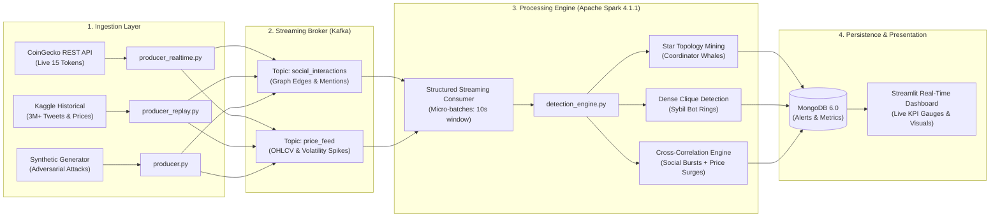

# 🛡️ CryptoShield — Real-Time Crypto Pump-and-Dump Detection

[](https://github.com/pranav-kalra22/CryptoShield_Real_Time_Pump_and_Dump_Detection/actions)
[](https://python.org)
[](https://spark.apache.org/)
[](https://kafka.apache.org/)
[](https://www.mongodb.com/)
[](https://streamlit.io/)
[](https://www.docker.com/)
[](LICENSE)

An enterprise-grade, distributed streaming analytics pipeline designed to detect coordinated cryptocurrency **Pump-and-Dump (P&D)** market manipulation in real time. **CryptoShield** couples high-throughput message streaming with graph topology mining and multi-signal price correlation to identify fraud syndicates before retail investors suffer catastrophic losses.

---

## 🏗️ System Architecture



---

## 🔍 Fraud Detection Methodology & Graph Theory

Coordinated market manipulation relies on two distinct social-network structural anomalies preceding artificial price inflation:

### 1. Star Topology Mining (Coordinator Whales)
Pump organizers orchestrate campaigns by broadcasting directives to dozens of satellite accounts without reciprocal engagement.
$$\text{Out-Ratio}(u) = \frac{\text{deg}^{+}(u)}{\text{deg}^{+}(u) + \text{deg}^{-}(u)} \ge 0.80 \quad \text{where } \text{deg}^{+}(u) \ge 10$$
*Any node meeting this criteria is flagged as a high-probability malicious broadcast hub (`STAR_TOPOLOGY`).*

### 2. Dense Clique Detection (Sybil Botnet Collusion)
Automated bot rings inflate social sentiment by aggressively retweeting and quoting each other in a dense web of artificial interactions. For a candidate subnetwork $\mathcal{S} = (V', E')$ with $|V'| \ge 5$:
$$\text{Density}(\mathcal{S}) = \frac{2 \cdot |E'|}{|V'| \cdot (|V'| - 1)} \ge 0.60$$
*Subgraphs exceeding $60\%$ edge completeness trigger critical collusion alerts (`CLIQUE_DETECTED`).*

### 3. Multi-Signal Confidence Matrix
Raw social anomalies are corroborated with incoming ticker volatility from `price_feed`.

| Signal Detected | Score Weight |
| :--- | :---: |
| **Dense Clique Subgraph** (`CLIQUE_DETECTED`) | `+3 pts` |
| **Star Topology Hub** (`STAR_TOPOLOGY`) | `+2 pts` |
| **Corroborated Price Spike** ($\Delta P \ge \text{threshold}$) | `+3 pts` |
| **Ground-Truth Bot Interaction Density** | `Up to +5 pts` |

- **`CRITICAL`** ($\ge 8$ pts): Immediate multi-layered confirmed attack (`PUMP_AND_DUMP_CONFIRMED`).
- **`HIGH`** ($5 - 7$ pts): Suspicious coordinated burst with pricing shift.
- **`MEDIUM`** ($2 - 4$ pts): Isolated topological anomaly.
- **`LOW`** ($< 2$ pts): Normal market volatility.

---

## 📁 Repository Structure

```
CryptoShield/
├── .github/workflows/
│   └── ci.yml                     ← Automated CI testing & linting
├── data/
│   ├── prices/                    ← Historical OHLCV datasets
│   └── tweets/                    ← Historical social tweet logs
├── docs/
│   └── CryptoShield_Interview_Masterclass.pdf ← Architecture & interview deck
├── tests/
│   └── test_detection_engine.py   ← Automated unit test suite
├── .env.example                   ← Environment configuration template
├── .gitignore                     ← Git ignore rules
├── docker-compose.yml             ← Infrastructure (Kafka + Zookeeper + Mongo + UIs)
├── detection_engine.py            ← Modular graph algorithms & metrics tracking
├── consumer.py                    ← Apache Spark Structured Streaming consumer
├── producer.py                    ← Synthetic data generator with attack injection
├── producer_realtime.py           ← Live zero-auth CoinGecko price & social generator
├── producer_replay.py             ← High-throughput Kaggle dataset replay engine
├── dashboard.py                   ← Streamlit real-time monitoring dashboard
├── Makefile                       ← One-click execution commands (Unix)
├── run.bat                        ← One-click execution script (Windows)
├── run.sh                         ← One-click execution script (Linux/macOS)
├── requirements.txt               ← Production & development dependencies
└── LICENSE                        ← MIT Open Source License
```

---

## ⚡ Quickstart Guide

### Prerequisites
| Component | Minimum Version | Installation Link |
| :--- | :--- | :--- |
| **Docker & Docker Compose** | Latest | [docker.com](https://www.docker.com/) |
| **Python** | 3.10 – 3.12 | [python.org](https://www.python.org/) |
| **Java JDK** | 17 or 21 (LTS) | [adoptium.net](https://adoptium.net/) |
| **Apache Spark** | 4.1.1 (Pre-built for Hadoop 3.3+) | [spark.apache.org](https://spark.apache.org/downloads.html) |

---

### Step 1: Environment Setup
Clone the repository and install dependencies:
```bash
git clone https://github.com/pranav-kalra22/CryptoShield_Real_Time_Pump_and_Dump_Detection.git
cd CryptoShield_Real_Time_Pump_and_Dump_Detection

# Install dependencies
pip install -r requirements.txt

# (Optional) Customize environment variables
cp .env.example .env
```

---

### Step 2: Launch Distributed Infrastructure
Start Kafka, Zookeeper, MongoDB, and their management web consoles via Docker:
```bash
docker-compose up -d

# Verify all 5 core containers are active:
docker ps
```

| Service Console | Port / URL | Description |
| :--- | :--- | :--- |
| **Kafka UI** | [http://localhost:8080](http://localhost:8080) | Topic inspection, partition monitoring & consumer lag |
| **Mongo Express** | [http://localhost:8082](http://localhost:8082) | Database document viewer (`crypto_shield.alerts`) |
| **Spark Driver UI** | [http://localhost:4040](http://localhost:4040) | Active streaming micro-batch metrics & DAG visualizer |

---

### Step 3: Run the Stream Processing Consumer
Launch the Spark Structured Streaming job:
```bash
spark-submit \
    --packages org.apache.spark:spark-sql-kafka-0-10_2.13:4.1.1 \
    consumer.py
```
*(Or use helper: `make consumer` / `run.bat consumer`)*

---

### Step 4: Stream Data to Kafka
Choose one of three data source modes:

#### Option A: Synthetic Simulation & Attack Injection (Fastest for testing)
```bash
# Normal traffic baseline
python producer.py

# Inject an active 60-second coordinated pump attack
python producer.py --pump
```

#### Option B: Live Market Feeds (Zero-Auth CoinGecko)
Streams real-time pricing for 15 top tokens without API keys and generates synthetic social volume bursts during detected volatility spikes:
```bash
python producer_realtime.py
```

#### Option C: Big Data Historical Replay (Kaggle Benchmark)
Replays millions of historical records from the 2017–2021 market cycles:
```bash
# 100x Real-time playback speed
python producer_replay.py --dataset all --speed 100

# Stress-test maximum pipeline throughput
python producer_replay.py --dataset tweets --speed 0
```

---

### Step 5: Launch Real-Time Dashboard
Start the interactive Streamlit monitoring application:
```bash
streamlit run dashboard.py
```
Open **[http://localhost:8501](http://localhost:8501)** in your browser to observe:
- **Live Fraud KPIs**: Critical, High, and Confirmed incident counters.
- **Dynamic Quality Gauges**: Real-time Precision, Recall, and F1-score tracking.
- **Alert Feed Table**: Filterable by severity and graph anomaly type.

---

## 🧪 Automated Testing

Unit tests validate graph topology discovery, edge-case thresholding, and confusion matrix accuracy:
```bash
# Run automated test suite
python -m unittest discover -s tests -v

# Or via Makefile / Windows runner:
make test        # Unix
run.bat test     # Windows
```

---

## ⚙️ Environment Variables Reference

All components support dynamic configuration via `.env` or system environment variables:

| Variable | Default | Purpose |
| :--- | :--- | :--- |
| `KAFKA_BROKER` | `localhost:9092` | Kafka broker host and port |
| `TOPIC_SOCIAL` | `social_interactions` | Kafka topic for social interactions |
| `TOPIC_PRICE` | `price_feed` | Kafka topic for price candles |
| `MONGO_URI` | `mongodb://localhost:27017/` | MongoDB connection string |
| `MONGO_DB` | `crypto_shield` | Database name |
| `CLIQUE_MIN_SIZE` | `5` | Minimum nodes to constitute a bot clique |
| `CLIQUE_DENSITY_THRESH` | `0.6` | Minimum edge density for clique detection |
| `STAR_MIN_DEGREE` | `10` | Minimum out-degree for star hub detection |
| `STAR_DEGREE_RATIO` | `0.8` | Out-degree / total-degree ratio for star hub |
| `COINGECKO_POLL_INTERVAL` | `30` | Seconds between live price polling cycles |

---

## 📜 License
This project is licensed under the **MIT License** — see the [LICENSE](LICENSE) file for details.
